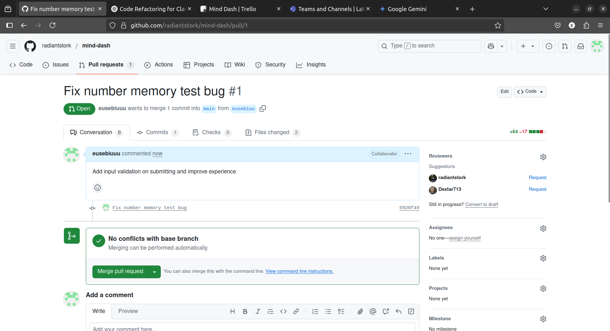
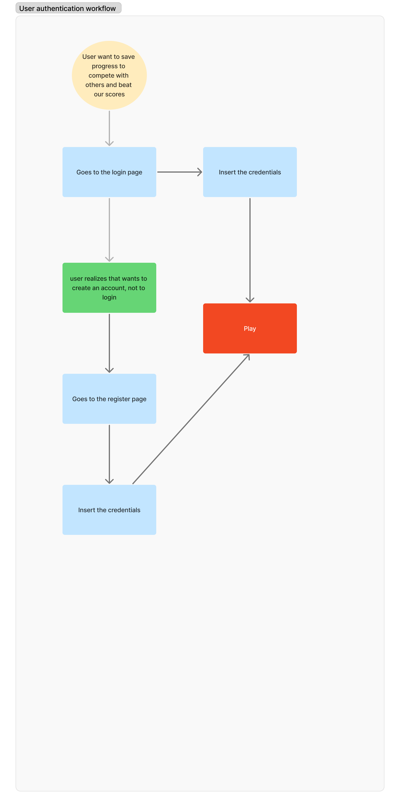
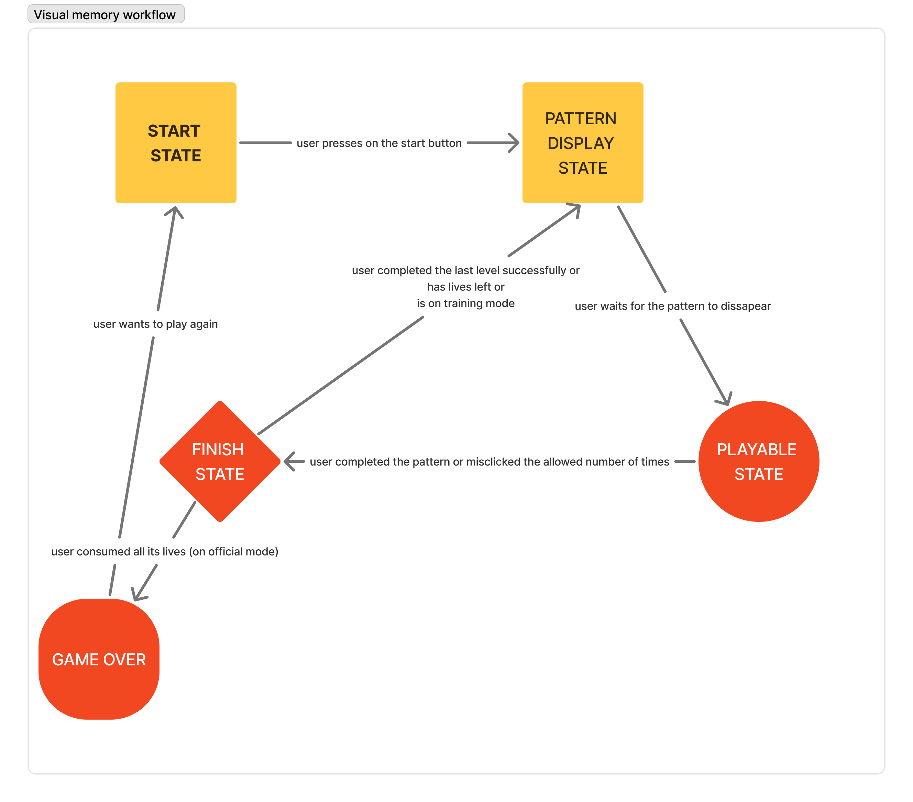
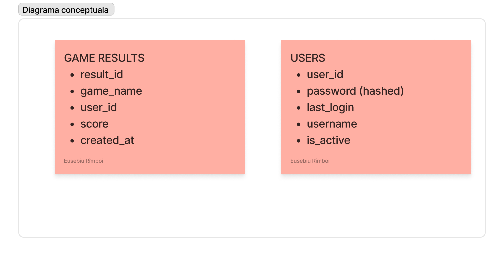

# Mind Dash

> De exemplu, puteți să creați un fișier README cu linkuri sau text pentru fiecare item de mai sus

#### Demo
- Pentru inceput, ca sa va faceti o idee despre ce consta acest proiect, uitati-va pe acest [demo](https://drive.google.com/file/d/1uwFgXXumnoubq2LGNEiiFmS07GvjfJaA/view?usp=drive_link).

#### Trello
- Pentru a consulta workflow-ul nostru, uitati-va pe sarcinile de pe Trello de [aici](https://trello.com/b/vMwyKZ0d/mind-dash).

#### Professional workflow
- Legat de worflow, uitati-va pe repo-ul nostru [aici](https://github.com/radiantstork/mind-dash/commits/main/).

#### Teste automate
- Pentru teste, analizati fisierele din front-end.

#### Bug report with pull request

#### Fisierul cu professional coding style
- Verificati fisierul [aici](./client/src/pages/TimePerceptionTest/TimePerceptionTest.tsx)

#### Design patterns
- Cele 2 design patterns implementate sunt **Observer** si **Strategy** pe care le puteti gasi [aici](./client/src/pages/TimePerceptionTest/TimePerceptionTest.tsx) si [aici](./client/src/components/Score.ts).

#### Prompt engineering documentation
- Cititi documentatia [aici](./promt_engineering_documentation.pdf)

### Diagrame
In prima diagrama se poate observa workflow-ul de autentificare al unui user

In aceasta diagrama se poate observa userflow-ul pentru jocul *visual memory*. Am realizat implementarea in acest fel pentru a integra si training mode si pentru a mari robustetea jocului.

La final, doresc sa prezint diagrama conceptuala a aplicatiei (fara tabelele generate automat de Django)

- [x] user stories (minim 10), backlog creation - 2 pct
- [x] diagrame (d. ex. diagrame UML, workflow) - 1 pct
- [x] source control cu git (branch creation, merge/rebase, pull requests, minim 10 commits) - 2 pct
- [x] teste automate - 2 pct
- [x] raportare bug si rezolvare cu pull request - 1 pct
- [x] comentarii cod si respectarea code standard - 1 pct
- [x] design patterns - 1 pct
- [x] prompt engineering: documentarea folosirii toolurilor de AI in timpul dezvoltarii software (d. ex. GitHub Copilot, chatGPT, Microsoft Copilot) - 2 pct
- [ ] **raport individual**
